# CyberAratta - High Level Architecture

## System Architecture Overview

## Module Architecture Detail

```mermaid
graph LR
    subgraph "Core Module"
        MODELS[📋 Models<br/>SiteStatistics<br/>Characters]
        VIEWS[👁️ Views<br/>Home Dashboard<br/>API Endpoints]
        UTILS[🔧 Utils<br/>Statistics Update<br/>Helper Functions]
    end

    subgraph "URL Checker Module"
        URLM[📋 URL Models<br/>URLCheck<br/>SecurityIntegration]
        URLV[👁️ URL Views<br/>Scan Interface<br/>Results Display]
        URLU[🔧 URL Utils<br/>API Clients<br/>Analyzers]
    end

    subgraph "Reporting Module"
        REPM[📋 Report Models<br/>PhishingReport<br/>ContactInfo]
        REPV[👁️ Report Views<br/>Submit Forms<br/>Admin Interface]
        REPF[📝 Report Forms<br/>File Upload<br/>Validation]
    end

    subgraph "Threat Map Module"
        TMAPM[📋 Threat Models<br/>Threat<br/>ThreatIntelligence]
        TMAPV[👁️ Map Views<br/>Interactive Map<br/>Real-time Updates]
        TMAPJS[🗺️ Map JavaScript<br/>Leaflet.js<br/>WebSocket Client]
    end

    subgraph "Quiz Module"
        QUIZM[📋 Quiz Models<br/>Question<br/>QuizSession]
        QUIZV[👁️ Quiz Views<br/>Question Display<br/>Result Processing]
        QUIZL[🧠 Quiz Logic<br/>Scoring<br/>Character Results]
    end

    subgraph "Email Analyzer Module"
        EMAILM[📋 Email Models<br/>EmailAnalysis<br/>HeaderInfo]
        EMAILV[👁️ Email Views<br/>Upload Interface<br/>Analysis Results]
        EMAILP[🔍 Email Parser<br/>Header Analysis<br/>Link Extraction]
    end

    %% Inter-module connections
    MODELS --> REPM
    MODELS --> TMAPM
    UTILS --> URLV
    UTILS --> REPV
```

## Data Flow Architecture

## Security Architecture

```mermaid
graph TD
    subgraph "Security Layers"
        WAF[🛡️ Web Application Firewall]
        HTTPS[🔒 HTTPS/TLS Encryption]
        AUTH[🔐 Authentication Layer]
        AUTHZ[✅ Authorization Layer]
        CSRF[🛡️ CSRF Protection]
        XSS[🛡️ XSS Protection]
        SQL[🛡️ SQL Injection Protection]
    end

    subgraph "Input Validation"
        VALID[✅ Input Validation]
        SANIT[🧹 Data Sanitization]
        UPLOAD[📁 File Upload Security]
    end

    subgraph "API Security"
        RATELIMIT[⏱️ Rate Limiting]
        APIKEY[🔑 API Key Management]
        CORS[🌐 CORS Configuration]
    end

    subgraph "Data Protection"
        ENCRYPT[🔒 Data Encryption]
        BACKUP[💾 Secure Backups]
        AUDIT[📋 Audit Logging]
    end

    WAF --> HTTPS
    HTTPS --> AUTH
    AUTH --> AUTHZ
    AUTHZ --> CSRF
    CSRF --> XSS
    XSS --> SQL
    SQL --> VALID
    VALID --> SANIT
    SANIT --> UPLOAD
    UPLOAD --> RATELIMIT
    RATELIMIT --> APIKEY
    APIKEY --> CORS
    CORS --> ENCRYPT
    ENCRYPT --> BACKUP
    BACKUP --> AUDIT
```

## Deployment Architecture

## Technology Stack

| Layer | Technology | Purpose |
|-------|------------|---------|
| **Frontend** | Bootstrap 5.3, jQuery, Chart.js, Leaflet.js | Responsive UI, Interactivity, Data Visualization |
| **Backend** | Django 5.2.4, Python 3.13 | Web Framework, Business Logic |
| **Database** | PostgreSQL, SQLite | Data Persistence |
| **Cache** | Redis | Caching, Session Storage, Message Broker |
| **Task Queue** | Celery | Asynchronous Task Processing |
| **Web Server** | Nginx, Gunicorn | HTTP Server, WSGI Server |
| **APIs** | VirusTotal, Google Safe Browsing, Kaspersky | Security Scanning Services |
| **Monitoring** | Django Debug Toolbar, Logging | Performance Monitoring, Error Tracking |

## Performance Considerations

- **Caching Strategy**: Redis for frequently accessed data
- **Database Optimization**: Query optimization, indexing
- **Static File Delivery**: CDN for static assets
- **Asynchronous Processing**: Celery for heavy operations
- **Load Balancing**: Horizontal scaling support
- **Database Replication**: Read replicas for scalability

## Scalability Features

- **Horizontal Scaling**: Multiple web servers and workers
- **Database Sharding**: Potential for data partitioning
- **Microservices Ready**: Modular app structure
- **API-First Design**: RESTful APIs for all functionality
- **Container Ready**: Docker and Kubernetes deployment support
